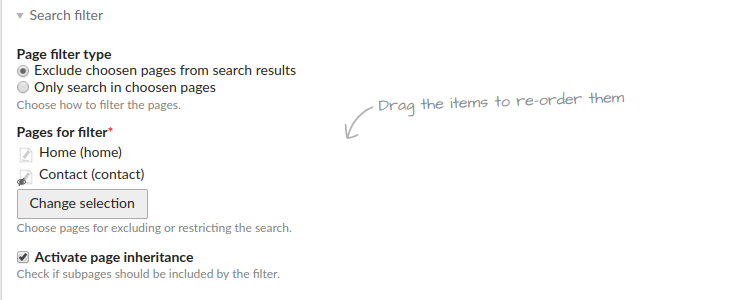

# Contao Search Bundle

[](https://packagist.org/packages/heimrichhannot/contao-search-bundle)
[](https://packagist.org/packages/heimrichhannot/contao-search-bundle)

This bundle contains enhancements for Contao Search.

## Features
* Page filter for search module
* Related search content element

## Usage

### Install

1. Install composer bundle   
    `composer require heimrichhannot/contao-search-bundle`
1. Enable/Disable features you want in your project config (see chapter configuration) and clear your cache
1. Update your database

### Filter your search results by page

1. Enable `huh_search.enable_search_filter` in your config (enabled by default)
1. Create or edit your search engine module and setup the search filter section as you like

    

### Related search content element

This element is basically the content hyperlink element (also uses the same templates) but with the twist, that it keeps the search parameters. It's designed for use together with news filter to link to another search module with a different filter config.

1. Create a Related search link content element on a page with an search module
1. Set another page with a search module as target

## Developers

### Configuration

```yaml
huh_search:
    enable_search_filter: true #enable/disable search filter for search module (defaults: true)
```
